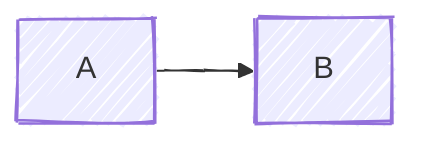

# home-tech

📖 **[Read the docs →](https://chris-peterson.github.io/home-tech/)**

Notes, diagrams, and decision records for the technology stack running my home.

The docs site is the primary surface — this README covers how to work on the repo itself.

## Repo layout

```text
docs/
├── README.md          # docs site landing page
├── _sidebar.md        # docsify navigation
├── index.html         # docsify shell (uses chris-peterson.github.io shared JS)
├── favicon.svg
├── diagrams/          # Mermaid diagrams
├── inventory/         # devices, services, power
└── decisions/         # choices and the reasoning behind them
.github/workflows/docs.yml   # Pages deployment
AGENTS.md                    # operating instructions for Claude Code sessions
```

## Authoring

Every file under `docs/` is hand-edited markdown. There is no build step and no generator.

### Where content goes

| Section | Holds |
|---------|-------|
| `docs/diagrams/` | Mermaid diagrams — topology, service maps, data flows. Network gear lives here rather than under Inventory. |
| `docs/inventory/` | Endpoint devices, cloud services, and power draw. |
| `docs/decisions/` | Why a change was chosen. |

Pick the section before writing. If a page fits none of them, add a section rather than filing it somewhere close.

### Decisions are written before the change lands

A decision record is written when the choice is made, while the reasoning is still at hand. `diagrams/` and `inventory/` keep describing what is installed until the hardware is actually in place, then get updated for real.

This is the split that keeps the site trustworthy: a reader can act on the current-state pages without checking whether they describe a plan.

### Mermaid

Diagrams use the hand-drawn look, so every one starts with the same init directive:

````markdown

````

Keep node labels short and on one line. `\n` and `<br>` do not render, and a label wider than its box gets clipped by the renderer rather than wrapped. Use separate nodes when a label runs long.

Sankey diagrams suit "what depends on what" views and ride the same CDN.

Render a new or edited diagram in a browser before pushing. Layout and edge routing come from the renderer, not the source, so valid syntax says nothing about whether the result is readable.

### Docsify wiring

This repo follows the chris-peterson hub pattern: `docs/index.html` loads the shared loader from `chris-peterson.github.io` and calls `initProject(...)`. No local CSS, no theme files, no standalone docsify scaffolding.

- `code_languages` in `initProject` should match what is actually in fenced code blocks.
- Sidebar links are absolute (`/decisions/`, `/inventory/power`).
- In `_sidebar.md`, `**Section**` is a static grouping label and `[Section](/path/)` with no children is a section that has its own index page.

Under local preview the shared theme CSS and `projects.yml` 404, because they are served from the hub rather than this repo. Those console errors are expected and do not indicate a broken page.

## Preview locally

```bash
just docs
```

Runs `docsify serve docs --open`.

## Publishing

`docs/**` changes on `main` deploy to GitHub Pages via `.github/workflows/docs.yml`.
