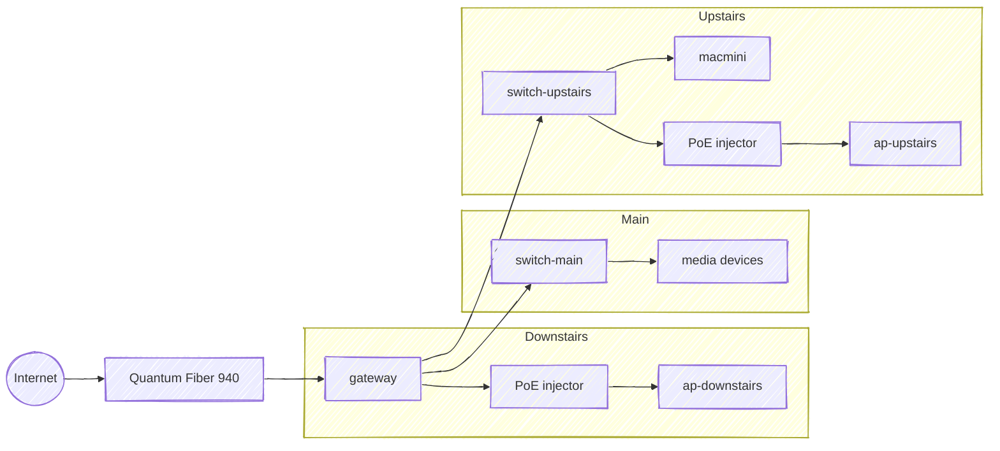

# Gateway Upgrade

**Status:** Decided, not yet installed · **Date:** 08/2026

Replace the [USG](/diagrams/network) with a UniFi Cloud Gateway Max NS, retire the 8-port switch, and move the access points to the top and bottom levels.

## Why now

The USG (installed 09/2019) routes at 1 Gbps but drops to roughly 85 Mbps with IDS/IPS enabled. On a [Quantum Fiber 940](https://www.getquantumfiber.com/internet/940-mbps) line that forces a choice between the bandwidth the line provides and intrusion prevention. The USG is also discontinued and classified legacy, with Ubiquiti signalling that a future major UniFi Network release drops management of it.

A Cloud Gateway runs the UniFi Network application on the gateway itself, so this also retires the UniFi Network Server currently hosted on [macmini](/inventory/devices?id=servers).

## Decision

**[UniFi Cloud Gateway Max NS](https://store.ui.com/us/en/category/cloud-gateways-compact/collections/cloud-gateway-max/products/ucg-max-ns)** ($199) — five 2.5 GbE ports, 2.3 Gbps IDS/IPS, quad-core Cortex-A53 at 1.5 GHz, 3 GB RAM, empty M.2 slot.

### Target topology

Gateway ports: WAN plus three LAN, leaving one spare.

### Hardware changes

| Device | Change | Cost |
|--------|--------|------|
| gateway | Ubiquiti USG → UniFi Cloud Gateway Max NS | $199 |
| switch-gateway | UniFi Switch 8 60W retired | — |
| switch-media | Renamed `switch-main`, home-runs to the gateway | — |
| switch-macmini | Renamed `switch-upstairs`, home-runs to the gateway | — |
| ap-kids | Renamed `ap-downstairs`, gains a PoE injector | $19 |
| ap-media | Renamed `ap-upstairs`, relocated from main to upstairs | — |
| UniFi Network Server | Retired from macmini, moves onto the gateway | — |

### Power

Rated maximums, which overstate real draw but are the only figures available before install:

| | Before | After |
|---|--------|-------|
| Downstairs closet | USG 7 W + US-8-60W 12 W | UCG-Max-NS 16.1 W |
| ap-downstairs (8 W) | PoE from switch-gateway | Dedicated injector |
| Flex switches | 5 W on USB-C, 6.4 W on PoE input | Both on USB-C |

Closet outlets stay at two: gateway plus one injector, where it is currently gateway plus switch. Measurements go in [Power](/inventory/power) once the gear is running.

## Reasoning

### Max NS over the Cloud Gateway Ultra

The [Ultra](https://store.ui.com/us/en/category/cloud-gateways-compact/products/ucg-ultra) is $129 and handles this build on port count and throughput: 1 Gbps IDS/IPS covers a 940 Mbps line, and every client on the LAN is gigabit today. The $70 premium buys two things the Ultra can never gain:

- **UniFi Protect.** The Ultra runs the Network application only and has no drive slot. Adding cameras later would mean a second box; a UNVR Instant alone costs $199.
- **2.5 GbE at every level.** With the Max NS, a future access point refresh or a 10 GbE-equipped Mac mini replacement is a device swap rather than a gateway swap.

Neither is a present-day gain. Both are options that stay open for $70.

### Storage stays empty

The M.2 slot feeds the UniFi OS applications: Protect recordings, Access events, Talk voicemail, and longer Network stat retention. It is formatted for UniFi OS and is not exposed over SMB or NFS. UniFi Drive, the actual NAS application, runs only on UNAS hardware.

The slot also caps at 2 TB with no redundancy, which is not a meaningful tier alongside the two 18 TB drives on macmini. The NS variant ships without storage; a $19 M.2 tray and a drive can be added if cameras ever happen.

### Retiring the 8-port switch

The US-8-60W sits between the gateway and everything else, so the 2.5 GbE switches on either side of it are held to 1 GbE. Its only remaining job is switching to those two switches and powering `ap-downstairs`.

The Max NS has enough ports to absorb all three connections directly. A PoE injector covers the access point at 8 W, well inside 802.3af. The [UniFi 2.5G PoE+ Adapter](https://store.ui.com/us/en/products/uacc-poe-plus-2-5g) ($19) is the same price as a gigabit part and passes 2.5 Gbps, so it does not become the bottleneck if that access point is ever replaced with a multi-gig model.

Both Flex 2.5G switches run on their bundled USB-C adapters rather than PoE, keeping every port available and every link at 2.5 GbE.

### Access points at the top and bottom

Across three levels, two access points cover best at the ends. Placing them downstairs and upstairs puts every level within one floor of a radio. The previous layout (downstairs and main) left upstairs two floors from one radio and one floor from the other.

Main level keeps its wired media devices and is served from both directions. Wireless demand there is low, and clients settle on the stronger radio without help. Floor assemblies attenuate more than the 2.4 GHz channel split does, so the vertical separation reduces contention between the two cells as well.

The spare UAP-AC-PRO stays on the shelf. It is Wi-Fi 5 Wave 1 and 3x3, older than the Wave 2 4x4 FlexHD already in service, so it is a replacement part rather than an upgrade.

## Migration notes

- Restoring the macmini controller backup onto the gateway carries sites and SSIDs; the gateway is re-adopted and its WAN and LAN configuration re-verified.
- Stat retention shrinks. A self-hosted controller backed by an 18 TB drive holds far more history than 16 GB of onboard flash.
- Renaming devices means re-adopting aliases in UniFi.
- Survey the main level with WiFiman after the access point moves and before mounting it permanently.
- Leave the retired upstairs and downstairs runs terminated. Spare drops cost nothing in the wall.

## Follow-ups

| Item | Notes |
|------|-------|
| Mac mini replacement | The 2018 unit is 1 GbE, already on the short list. A 10 GbE build-to-order replacement would negotiate 2.5 GbE against the new switches. |
| Access point refresh | FlexHD is Wi-Fi 5 from 2018. A Wi-Fi 6E/7 model with a 2.5 GbE uplink is what makes the 2.5 GbE fabric carry real traffic. |
| UniFi Protect | Needs the $19 M.2 tray plus a drive. Supports 15 HD, 8 2K, or 5 4K cameras. |
| switch-main port budget | Five ports total. Uplink plus the wired media devices; confirm the count before assuming a spare. |
