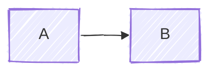

# Diagrams

Mermaid diagrams of the home tech stack — network topology, service relationships, data flows.

All diagrams use the hand-drawn look:

````markdown

````

## Index

- [Network Topology](/diagrams/network) — end-to-end path from ISP to home devices
