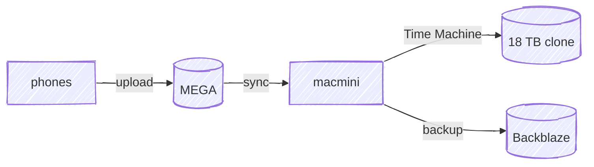

# Data Flow

How photos and other personal data move from the devices that generate them out to offsite storage.

## Hops

- **phones → MEGA** — phones auto-upload photos and video to the [MEGA](/inventory/services) cloud account. This is the always-on copy and the only one that exists immediately after a photo is taken.
- **MEGA → macmini** — the [macmini](/inventory/devices?id=servers) syncs MEGA down to its local 18 TB drive, turning the cloud copy into something we physically own.
- **macmini → 18 TB clone** — Apple Time Machine mirrors the primary drive to a second 18 TB drive on the macmini. Protects against single-drive failure, but not against a house-level loss.
- **macmini → Backblaze** — [Backblaze](/inventory/services) backs the macmini up offsite, so a house-level loss (fire, theft) still has a recoverable copy.

See [Network Topology](/diagrams/network) for the physical path each hop takes.
