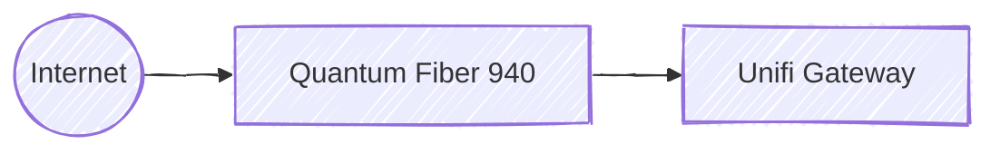

# Network Topology

End-to-end path from ISP to home devices. Updated as the stack evolves.

## Ingress

ISP service is [Quantum Fiber 940](https://www.getquantumfiber.com/internet/940-mbps), terminating at a Unifi Internet Gateway.
