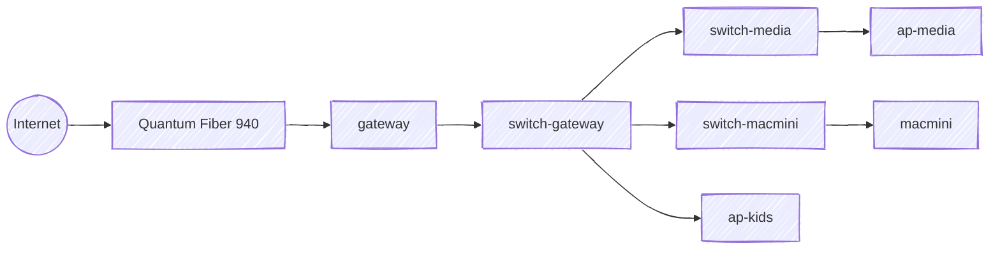

# Network Topology

End-to-end path from ISP to home devices. Updated as the stack evolves.

## Ingress

ISP service is [Quantum Fiber 940](https://www.getquantumfiber.com/internet/940-mbps), terminating at the gateway.

## Hardware

| Device          | Model                                          | Install Date |
|-----------------|------------------------------------------------|--------------|
| gateway         | Ubiquiti USG (UniFi Security Gateway)          | 09/2019      |
| switch-gateway  | UniFi Switch 8 60W                             | 08/2020      |
| switch-media    | Ubiquiti USW Flex 2.5G                         | 02/2026      |
| switch-macmini  | Ubiquiti USW Flex 2.5G                         | 02/2026      |
| ap-media        | Ubiquiti FlexHD                                | 01/2023      |
| ap-kids         | Ubiquiti Swiss Army Knife                      | 07/2025      |

All inter-switch links run at 1 GbE.

Spanning-tree root is the gateway (priority 0); switch-media runs at priority 4096, switch-macmini at 32768 — so if the backbone ever loops, switch-macmini is the first to have a port blocked.

## Wireless

Both APs broadcast the same SSID, with 2.4 GHz and 5 GHz radios:

| AP        | Upstream        | 2.4 GHz |
|-----------|-----------------|---------|
| ap-media  | switch-media    | Ch. 1   |
| ap-kids   | switch-gateway  | Ch. 11  |
